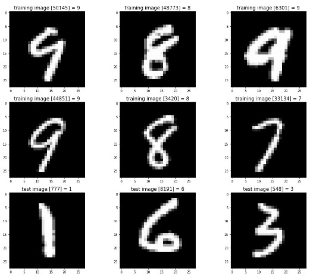

# Digit Recognizer

## Description:

AI model that can guess handwritten digits with 97% accuracy. Trained on the MNIST dataset.

[Download](https://github.com/liamdpearson/digit-recognizer/releases/download/latest/digit-recognizer.exe) the testing app to try it out.

In order for the model to be accurate you must draw the digits in the center of the image. Ex:

  

